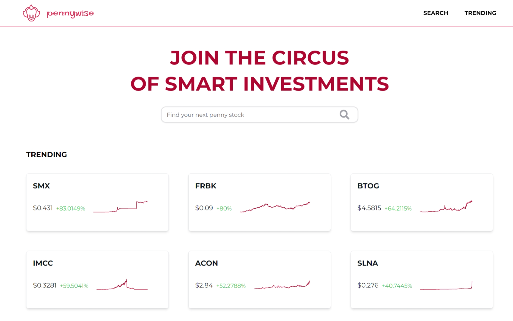
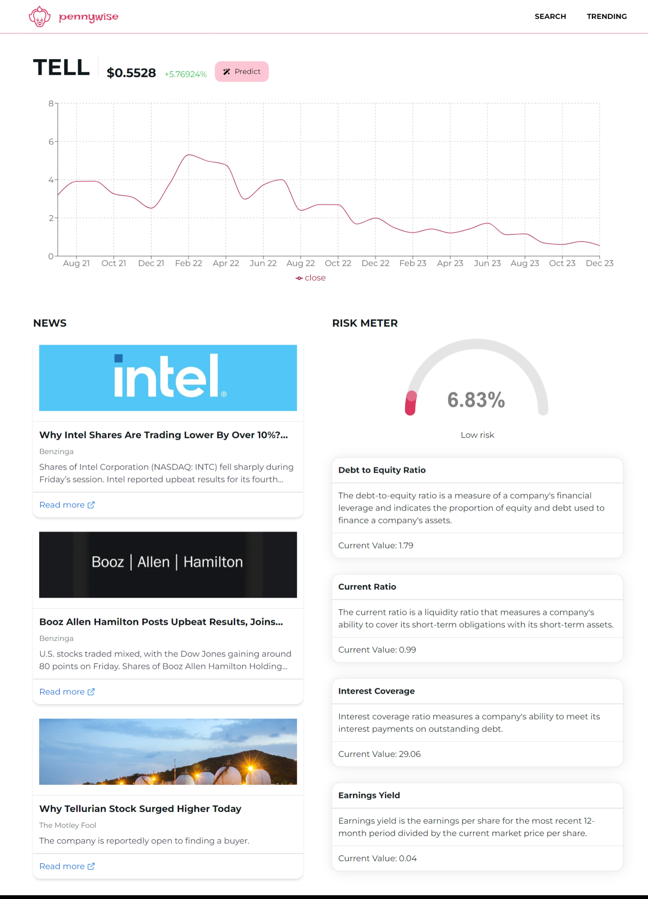

# Pennywise - The Penny Stock Explorer 🎈

Welcome to Pennywise, your whimsical companion in the world of penny stocks! 🤡 Explore, discover, and keep an eye on those elusive penny stocks with ease and a touch of playfulness.

Deployed on Vercel: https://pennywise-two.vercel.app/

## Technologies Used

<!-- prettier-ignore -->
| Technology | Purpose |
|------------|---------|
|  [Next.js](https://nextjs.org/) | React framework for building web applications |
|  [React](https://reactjs.org/) | JavaScript library for building user interfaces |
|  [Tailwind CSS](https://tailwindcss.com/) | Utility-first CSS framework for styling |
|  [NextUI](https://nextui.org/) | UI library for Tailwind CSS with theming support |

## Contribution Guidelines

Feel free to contribute to the development of Pennywise! Follow these guidelines:

1. Fork the repository and create a new branch for your feature or bug fix.

2. Make your changes and submit a pull request.

3. Ensure your code follows the coding standards and is well-documented.

## License

This project is licensed under the [MIT License](LICENSE).

## Acknowledgments

Special thanks to the organizers and participants of TamuHack for creating an inspiring environment that sparked the magic behind Pennywise. 🚀

Participating in Tamuhack was an enchanting experience that fueled the creativity and innovation woven into every line of code in this app.
